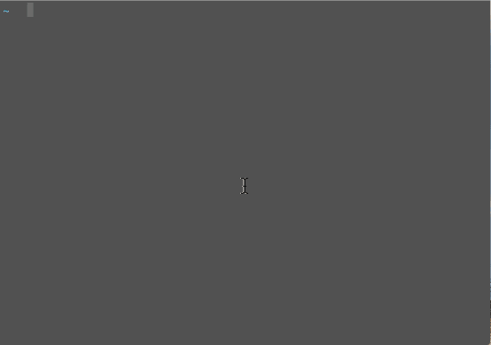

# fauxcli

[](https://circleci.com/gh/nextrevision/fauxcli)

FauxCLI (pronounced foak-ley) mocks a command line client from a given YAML file.



## Quickstart

Install:

```
$ go get github.com/nextrevision/fauxcli
```

Create a `cli.yaml` file in your current directory:

```
name: spiderpig
help: does whatever a spiderpig does
commands:
  - name: swing
    help: swings from a web
    output: |
      I can't do that, I'm a pig!
  - name: plop
    help: super secret maneuver
    output: |
      Look out!
```

Run `fauxcli`:

```
$ fauxcli
does whatever a spiderpig does

Usage:
  spiderpig [command]

Available Commands:
  swing       swings from a web
  plop        super secret maneuver

Flags:
  -h, --help   help for spiderpig

Use "spiderpig [command] --help" for more information about a command.
```

With a subcommand:

```
$ fauxcli swing
I can't do that, I'm a pig!
```

Aliasing:

```
$ alias spiderpig='fauxcli'
$ spiderpig plop
Look out!
```

## Installation

With go:

```
go get github.com/nextrevision/fauxcli
```

Using GitHub releases:

```
curl -s -o /usr/local/bin/fauxcli https://github.com/nextrevision/fauxcli/archive/fauxcli
chmod +x /usr/local/bin/fauxcli
```

## `cli.yaml`

The `cli.yaml` file holds all the details required in order to mock a CLI application. By default, `fauxcli` will look in your current directory for this file. You can override this setting with the `CLIMOCK_FILE` environment variable pointing to a different YAML file of your choosing.

```
---
# (required) name of the command
name: mycliapp

# (required) the help text for the command (displayed with -h)
help: does something cool

# additional command aliases
aliases: ["myapp", "app"]

# output to print when the command is run
# if this key is omitted, the command will act as a
# parent to any subcommands, essentially doing nothing
# but printing the help text
output: |
  Hello, World!

# flags available to the command
flags:
    # (required) long name of the flag (--debug)
  - name: debug

    # (required) help text for the flag
    help: enables debugging

    # short name for the flag (-d)
    short: d

    # default value of the flag
    default: false

    # make the flag globally available
    global: true

    # the type of the value (default string)
    # available types:
    #   - string
    #   - bool
    #   - int
    #   - float
    type: bool

# subcommands (nested from all the options above)
commands:
  - name: subcommand1
    help: a subcommand
    flags:
      - name: upper
        help: converts output to uppercase
        short: u
        type: bool
    output: |
      {{ if .Flags.upper.Bool -}}
      HELLO FROM SC1!
      {{ else -}}
      Hello from SC1!
      {{ end -}}
  - name: subcommand2
    help: another subcommand with children
    commands:
      - name: child1
        help: the first child command
        output: |
          Hello from child1
      - name: child2
        help: the second child command
        output: |
          Hello from child2
```

## Output

The `output` section of a command uses the Golang [template](https://golang.org/pkg/text/template/) syntax (also see [https://gohugo.io/templates/go-templates/](https://gohugo.io/templates/go-templates/)). There are two main variables exposed to you:

1. `Flags`, the list of flags defined in your `cli.yaml`.
2. `Args`, a list of additional string arguments passed to the command.

### Flags

Flags can be accessed using the following syntax in the output section: `{{ .Flags.flagname }}`. This, however, is not very useful on its own. If you want to retrieve the genericly typed value of a flag, you can use `{{ .Flags.flagname.Value }}`. This is useful for just dumping the value, regardless of type. If you are doing a comparison, like checking if a string flag's value is empty, you need to retrieve the typed value instead, so for a string `{{ .Flags.flagname.String }}`, bools `{{ .Flags.flagname.Bool }}`, ints `{{ .Flags.flagname.Int }}`, and floats `{{ .Flags.flagname.Float }}`.

### Args

Additional arguments passed to the command can be accessed via the `{{ .Args }}` variable. Useful functions related to args are:

* Checking if args are passed (or empty): `{{ .Args | lengthis 0 }}`
* Retrieving the first arg: `{{ .Args | first }}`
* Looping over the args:

```
{{ range $i, $v := .Args -}}
arg{{ $i }} value: {{ $v }}
{{ end -}}
```

### Pipelines/Filters (methods available in functions)

A number of methods are made available to use in the functions, taken primarily from [Pallinder/go-randomdata](https://github.com/Pallinder/go-randomdata#usage) and [leekchan/gtf](https://github.com/leekchan/gtf#reference):

#### Random Data Functions

Sometimes is useful to mix up the output type you will receive. Also "foo" and "bar" get a little boring compared to "sargentbrindle" and "fishhail". Here are some functions to generate random values in your output templates (from [Pallinder/go-randomdata](https://github.com/Pallinder/go-randomdata#usage)):

| Function | Description | Example | Usage |
|----------|-------------|---------|-------|
| name | returns a silly, random, one-word name | Apeflannel | `{{ name }}`|
| fullname | returns a capitalized, first and last name | Natalie White | `{{ fullname }}` |
| email | returns a random email address | jaydendavis@example.com | `{{ email }}` |
| city | returns the name of a random city | Skidaway Island | `{{ city }}` |
| street | returns the name of a random street | Wilson Ct | `{{ street }}` |
| address | returns a random street address (two lines) | 48 Lincoln Circle,\nBurrton, MS, 85910 | `{{ address }}` |
| number | returns a random number for a given range | 4 | `{{ number 1 10 }}` |
| paragraph | returns a random paragraph | One dog rolled before him...snip | `{{ paragraph }}` |
| ipaddress | returns a random IPv4 address | 32.254.96.245 | `{{ ipaddress }}` |
| day | returns a random day | Sunday | `{{ day }}` |
| month | returns a random month | November | `{{ month }}` |
| date | returns a random date | Wednesday 8 Apr 2016 | `{{ date }}` |


#### Imported from GTF

Again, see the [reference here](https://github.com/leekchan/gtf#reference) for additional details.

* replace
* default
* length
* lower
* upper
* truncatechars
* urlencode
* wordcount
* divisibleby
* lengthis
* trim
* capfirst
* pluralize
* yesno
* rjust
* ljust
* center
* filesizeformat
* apnumber
* intcomma
* ordinal
* first
* last
* join
* slice
* random
* striptags

#### Custom

| Function | Description | Usage |
|----------|-------------|-------|
| string | type casts value as a string | `{{ .Flags.flagname.Value | string }}` |
| bool | type casts value as a bool | `{{ .Flags.flagname.Value | bool }}` |
| int | type casts value as a int | `{{ .Flags.flagname.Value | int }}` |
| float | type casts value as a float (float64) | `{{ .Flags.flagname.Value | float }}` |
| count | returns an iterator with the specified size | `{{ range $i, $_ := count 3  }}` |

## Examples

Check out the examples directory for some sample apps.
